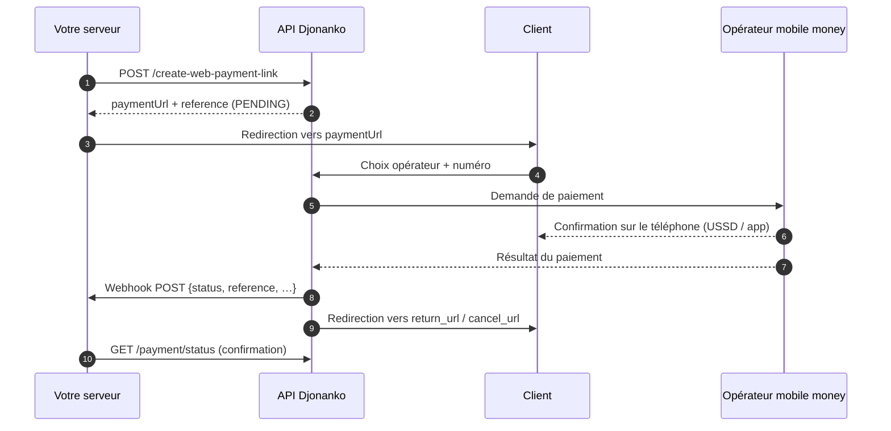

## Vue d'ensemble

## Les statuts d'un paiement

| Statut | Signification | Final ? |
|---|---|---|
| `PENDING` | Lien créé, en attente du paiement du client. | Non |
| `SUCCESS` | Paiement confirmé par l'opérateur. Votre solde est crédité du montant net de frais. | Oui |
| `FAILED` | Paiement refusé (solde insuffisant, annulation, timeout de l'opérateur) **ou lien expiré**. | Oui |

<Info>
Un lien `PENDING` non payé passe automatiquement en `FAILED` **24 heures** après sa création. Un cron tourne toutes les 30 minutes, l'expiration effective peut donc intervenir jusqu'à 30 minutes après le délai.
</Info>

## La page de paiement hébergée

Le client est redirigé vers `https://checkout.djonanko.ci/{reference}`. Cette page :

1. affiche le nom de votre boutique, le montant et les frais applicables ;
2. propose les opérateurs disponibles dans le pays du paiement ;
3. collecte le numéro du client (ou les données carte pour Visa) ;
4. déclenche la demande de paiement et attend la confirmation ;
5. redirige vers votre `return_url` en cas de succès, `cancel_url` sinon.

Vous n'avez **aucune donnée sensible à manipuler** : numéros, OTP et données carte restent entre le client, Djonanko et l'opérateur.

<Warning>
La redirection vers `return_url` **n'est pas une preuve de paiement**. Un utilisateur peut ouvrir cette URL manuellement. Fiez-vous uniquement au [webhook](/guides/webhooks) ou à [`GET /web-merchant/payment/status`](/api-reference/paiements/payment-status).
</Warning>

## Deux modes : lien ou QR code

| Mode | Paramètre | Réponse | Cas d'usage |
|---|---|---|---|
| **Lien** | `isQrCode` absent ou `false` | `paymentUrl` | E-commerce, redirection depuis un site ou une app |
| **QR code** | `isQrCode: true` | `qrcode` (PNG en data URL) | Point de vente, facture imprimée, affichage sur écran |

Dans les deux cas, le QR code encode simplement l'URL de la page de paiement : les deux modes aboutissent au même parcours client.

## Frais

Les frais sont calculés au moment du paiement selon l'opérateur, le pays et le montant. Ils sont :

- **affichés au client** sur la page de paiement ;
- **communiqués dans le webhook** (`fees`) pour les paiements `SUCCESS` ;
- **déduits du montant crédité** sur votre solde.

Le montant `amount` que vous transmettez est celui que le client voit et paie ; le net crédité est `amount - fees`.

## Métadonnées

Le champ `metadata` accepte trois clés (`order_id`, `email`, `phoneNumber`). Il est renvoyé **à l'identique** dans le webhook et dans la liste des paiements : c'est le moyen le plus simple de rapprocher un paiement avec votre commande.

`order_id` a un rôle particulier : il est aussi stocké comme **référence marchand** du paiement, affiché dans le dashboard, recherchable, et présent dans les exports et rapports PDF.
