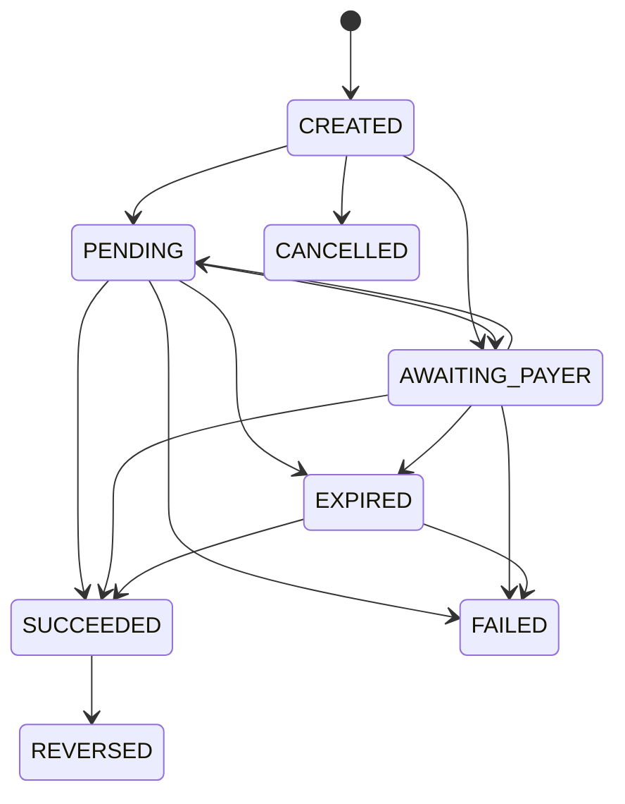

## Les huit états

| État | Signification | Définitif | Votre portefeuille |
|---|---|---|---|
| `CREATED` | Enregistrée, pas encore soumise | — | — |
| `PENDING` | Soumise, en attente d'issue | — | Transfert : immobilisé |
| `AWAITING_PAYER` | Encaissement : le payeur doit agir | — | — |
| `SUCCEEDED` | Aboutie | ✅ | Crédité ou débité |
| `FAILED` | Refusée | ✅ | Immobilisation levée |
| `EXPIRED` | Aucune issue dans le délai | ✅ | Immobilisation levée |
| `CANCELLED` | Annulée avant exécution | ✅ | Rien n'a été engagé |
| `REVERSED` | Contre-passée | ✅ | Écriture inverse posée |

## Transitions possibles



Deux garanties que ce schéma matérialise.

<Note>
**Une opération réussie ne repasse jamais en échec.** Le seul mouvement possible depuis `SUCCEEDED` est `REVERSED`, qui est une contre-passation explicite, toujours accompagnée d'une notification `operation.reversed`. Vous pouvez donc traiter un `cashin.succeeded` sans craindre qu'il soit silencieusement annulé.
</Note>

<Note>
**Une opération expirée peut encore aboutir.** Un opérateur mobile money confirme parfois plusieurs heures après notre délai d'attente, et dans ce cas les fonds sont bien arrivés. `EXPIRED → SUCCEEDED` est donc permis : ne considérez pas `EXPIRED` comme un échec comptable définitif tant que vous n'avez pas rapproché votre relevé.
</Note>

## `AWAITING_PAYER` : le cas à ne pas rater

C'est le seul état qui demande une action de votre part.

| Opérateurs | Statut à la création | Ce que vous faites |
|---|---|---|
| **Orange, Wave, Djamo** | `AWAITING_PAYER` | **Envoyez votre client sur `payerActionUrl`** |
| **MTN, Moov** | `PENDING` | Rien : le client reçoit une demande de validation sur son téléphone |

<Warning>
Si vous ignorez `payerActionUrl`, l'encaissement n'aboutira **jamais** : le client n'a aucun moyen de payer. L'opération passera en `EXPIRED` au bout de 30 minutes.

Ne codez pas en dur la liste des opérateurs à rediriger : testez `requiresPayerAction`. Le comportement d'un opérateur peut évoluer.
</Warning>

```javascript
const { operation } = await creerEncaissement(commande);

if (operation.requiresPayerAction) {
  // Orange, Wave, Djamo : le client doit passer par cette page
  return redirect(operation.payerActionUrl);
}

// MTN, Moov : rien à afficher, le client valide sur son téléphone
return afficherEcranAttente(operation.reference);
```

## Délais d'expiration

| Type | Délai | Pourquoi |
|---|---|---|
| Encaissement | **30 minutes** | Une demande de validation mobile money expire bien avant chez l'opérateur |
| Transfert | **6 heures** | Un transfert dépend du traitement de l'opérateur, qui peut prendre des heures en période de charge |

Le champ `expiresAt` donne l'échéance exacte de chaque opération.

## Suivre l'historique

```bash
curl https://guichet.apidjonanko.tech/v1/operations/GUI-CI-20261001-7K2M9QX4/events \
  -H "x-api-key: gk_live_…" -H "x-api-secret: gs_live_…"
```

```json
{
  "items": [
    { "fromStatus": null, "toStatus": "CREATED", "reason": "Opération enregistrée", "occurredAt": "2026-10-01T10:12:04.000Z" },
    { "fromStatus": "CREATED", "toStatus": "AWAITING_PAYER", "reason": "Réponse de soumission", "occurredAt": "2026-10-01T10:12:05.000Z" },
    { "fromStatus": "AWAITING_PAYER", "toStatus": "SUCCEEDED", "reason": "Confirmation reçue", "occurredAt": "2026-10-01T10:13:47.000Z" }
  ]
}
```

Utile lors d'un litige : vous voyez le parcours complet, pas seulement l'état final.

## La consultation reste la source de vérité

<Warning>
Ne faites jamais dépendre un état critique de la seule arrivée d'une notification. Les notifications peuvent être retardées, et votre endpoint peut être momentanément indisponible.

[`GET /operations/{reference}`](/guichet/api/get-operation) donne toujours l'état réel. Prévoyez une tâche de rattrapage qui interroge les opérations restées non définitives au-delà de leur `expiresAt`.
</Warning>
