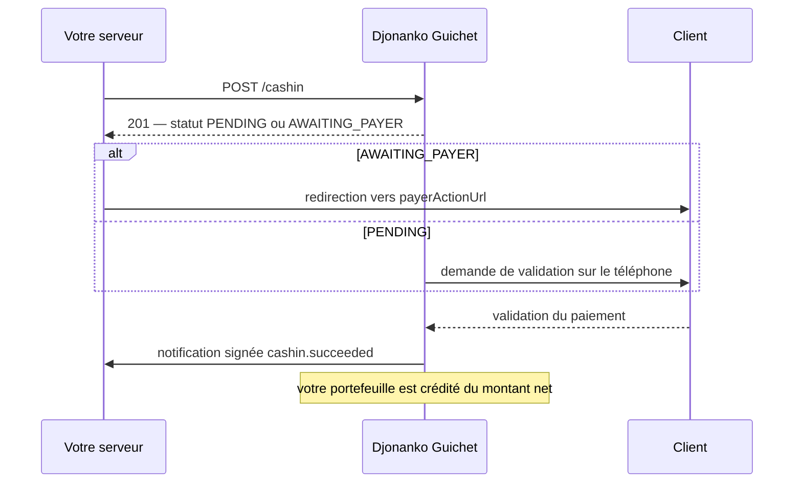
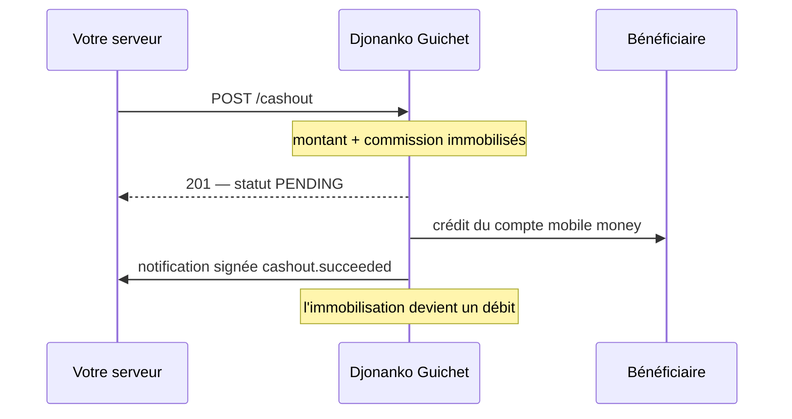

L'**API Guichet** permet à une entreprise d'**encaisser** (`cash-in`) et de **transférer** (`cash-out`) sur les réseaux mobile money d'Afrique de l'Ouest et du Centre, directement depuis ses serveurs.

Elle s'adresse aux entreprises qui intègrent le mobile money dans leur propre produit : places de marché, fintechs, opérateurs de paie, plateformes de collecte.

<Note>
L'API Guichet est **distincte de Djonanko Pay**. Djonanko Pay sert à encaisser via un lien de paiement ou un QR code, avec une page de paiement hébergée. Le Guichet n'a ni lien ni page : vous appelez l'API, votre client est sollicité sur son téléphone, vous recevez l'issue par notification.

Les deux produits ont leurs propres clés, leur propre URL et leur propre documentation. Les clés de l'un ne fonctionnent pas sur l'autre.
</Note>

## Ce que vous pouvez faire

<CardGroup cols={2}>
  <Card title="Encaisser" icon="arrow-down" href="/guichet/api/cashin">
    Débiter le compte mobile money d'un client vers votre portefeuille Djonanko.
  </Card>
  <Card title="Transférer" icon="arrow-up" href="/guichet/api/cashout">
    Verser des fonds sur le compte mobile money d'un bénéficiaire.
  </Card>
  <Card title="Suivre votre portefeuille" icon="wallet" href="/guichet/portefeuille">
    Solde, part immobilisée, relevé de tous les mouvements.
  </Card>
  <Card title="Être notifié" icon="bell" href="/guichet/webhooks">
    Notifications signées à chaque issue d'opération.
  </Card>
</CardGroup>

## Les cinq règles à connaître

<Steps>
  <Step title="L'URL de base est https://guichet.apidjonanko.tech/v1">
    Tous les chemins de cette documentation sont relatifs à cette base.
  </Step>
  <Step title="Deux en-têtes sur chaque appel">
    `x-api-key` et `x-api-secret`. Voir [Authentification](/guichet/authentification).
  </Step>
  <Step title="Les montants sont des entiers">
    Le XOF, le XAF et le GNF n'ont pas de sous-unité. `5000` vaut 5 000 FCFA. Aucune décimale n'est acceptée.
  </Step>
  <Step title="L'en-tête Idempotency-Key est obligatoire sur les opérations">
    Sans lui, un délai réseau suivi d'un rejeu de votre côté produirait deux opérations. Voir [Idempotence](/guichet/idempotence).
  </Step>
  <Step title="Les notifications ne sont pas la source de vérité">
    Si une notification vous échappe, [`GET /operations/{reference}`](/guichet/api/get-operation) donne toujours l'état réel. N'attendez jamais une notification indéfiniment.
  </Step>
</Steps>

## Comment se déroule une opération

### Encaissement

### Transfert

## Pour commencer

<CardGroup cols={2}>
  <Card title="Démarrage rapide" icon="rocket" href="/guichet/demarrage-rapide">
    De la création du compte au premier encaissement.
  </Card>
  <Card title="Référence API" icon="code" href="/guichet/api/cashin">
    Tous les endpoints, avec playground interactif.
  </Card>
</CardGroup>
