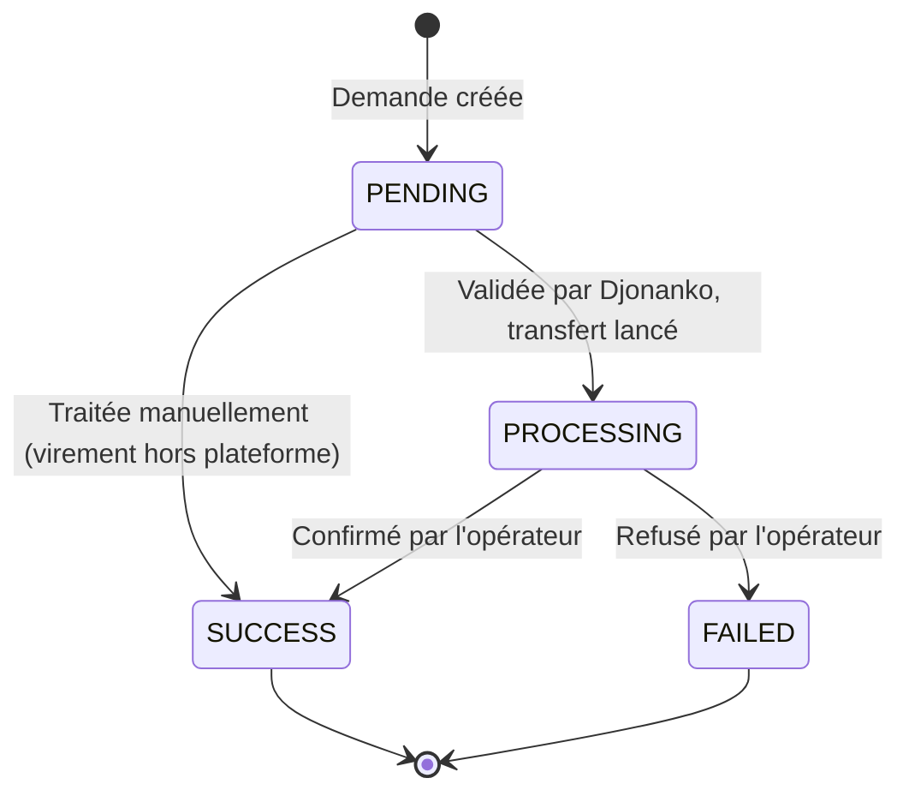

Chaque paiement `SUCCESS` crédite votre **solde** du montant net de frais. Un reversement (ou *disbursement*) transfère tout ou partie de ce solde vers un compte de votre choix.

## Le cycle d'un reversement



| Statut | Signification |
|---|---|
| `PENDING` | Demande enregistrée, en attente de validation par l'équipe Djonanko |
| `PROCESSING` | Validée : votre solde est débité et le transfert est lancé chez l'opérateur |
| `SUCCESS` | Fonds reçus sur votre compte |
| `FAILED` | Transfert échoué (voir `failureReason`) |

<Info>
Les reversements sont **validés manuellement** par Djonanko avant exécution. Le montant minimum est de **500 FCFA** et ne peut excéder votre solde disponible.
</Info>

## Deux façons de récupérer vos fonds

| Mode | Fonctionnement | Pour qui |
|---|---|---|
| **Règlement automatique T+0** | Votre solde est reversé automatiquement **chaque jour**, le jour même des encaissements, sur votre compte principal. | Trésorerie au quotidien, forte activité |
| **Règlement automatique T+1** | Votre solde est reversé automatiquement **tous les deux jours** sur votre compte principal. | Regrouper les reversements, limiter le nombre de virements |
| **À la demande** (par défaut) | Aucun reversement automatique : vous lancez vous-même chaque demande, quand vous le souhaitez, depuis le dashboard ou l'API. | Contrôle total du calendrier |

Le mode de règlement se choisit dans le dashboard, onglet **Remboursements**. Vous pouvez en changer à tout moment ; le règlement automatique nécessite un [compte de reversement principal](#1-enregistrer-un-compte-de-reversement).

<Note>
Avec le règlement automatique, chaque reversement suit exactement le même cycle qu'une demande manuelle (`PENDING` → `PROCESSING` → `SUCCESS`) et apparaît dans la liste des reversements. Vous pouvez toujours lancer une demande manuelle en complément.
</Note>

## 1. Enregistrer un compte de reversement

Avant toute demande, déclarez au moins un compte et définissez-le comme **principal**. Cela se fait dans le dashboard (**Gestion des comptes**) ou par API.

<Tabs>
  <Tab title="Mobile money">
    ```bash
    curl -X POST https://apidjonanko.tech/web-merchant/payout-accounts \
      -H "Content-Type: application/json" \
      -H "authenticationtoken: $DJONANKO_TOKEN" \
      -d '{
        "merchant_reference": "beautyshop",
        "type": "wave",
        "isPrimary": true,
        "phoneNumber": "+2250700000000",
        "country": "CI"
      }'
    ```
    `type` accepte `orange`, `moov`, `mtn` ou `wave`.
  </Tab>
  <Tab title="Compte bancaire">
    Récupérez d'abord l'identifiant de la banque :

    ```bash
    curl https://apidjonanko.tech/banks/active
    ```

    Puis créez le compte :

    ```bash
    curl -X POST https://apidjonanko.tech/web-merchant/payout-accounts \
      -H "Content-Type: application/json" \
      -H "authenticationtoken: $DJONANKO_TOKEN" \
      -d '{
        "merchant_reference": "beautyshop",
        "type": "bank",
        "isPrimary": true,
        "beneficiaryName": "SARL Beauty Shop",
        "bankId": "<id_banque>",
        "branchCode": "01001",
        "accountNumber": "012345678901",
        "ribKey": "45",
        "swiftCode": "SGBCCIABXXX"
      }'
    ```

    Le code SWIFT doit comporter 8 ou 11 caractères alphanumériques majuscules.
  </Tab>
</Tabs>

Pour changer de compte principal : [`PATCH /payout-accounts/{id}/set-primary`](/api-reference/reversements/set-primary-payout-account).

## 2. Demander un reversement

```bash
curl -X POST https://apidjonanko.tech/web-merchant/request-disbursement \
  -H "Content-Type: application/json" \
  -H "authenticationtoken: $DJONANKO_TOKEN" \
  -d '{ "reference": "beautyshop", "amount": 50000 }'
```

```json
{
  "id": "…",
  "reference": "beautyshop",
  "amount": 50000,
  "destination": "+2250700000000",
  "country": "CI",
  "operator": "wave",
  "status": "PENDING",
  "payoutAccountId": "…",
  "payoutDetails": { "type": "wave", "phoneNumber": "+2250700000000", "country": "CI" },
  "createdAt": "2026-09-18T10:00:00.000Z"
}
```

La demande est **toujours adressée au compte principal** s'il existe. Les champs `destination`, `country` et `operator` ne sont pris en compte que si aucun compte principal n'est enregistré (compatibilité avec les anciennes intégrations).

Erreurs possibles : solde insuffisant, montant < 500 FCFA, aucun compte principal. Voir [Gestion des erreurs](/concepts/erreurs).

## 3. Suivre les reversements

```bash
# Tous les reversements
curl "https://apidjonanko.tech/web-merchant/list-disbursements?merchant_reference=beautyshop" \
  -H "authenticationtoken: $DJONANKO_TOKEN"

# Uniquement ceux en cours
curl "https://apidjonanko.tech/web-merchant/list-disbursements?merchant_reference=beautyshop&status=PROCESSING" \
  -H "authenticationtoken: $DJONANKO_TOKEN"

# Compteurs par statut
curl "https://apidjonanko.tech/web-merchant/refunds-stats?merchant_reference=beautyshop" \
  -H "authenticationtoken: $DJONANKO_TOKEN"
```

<Note>
Il n'y a pas de webhook pour les reversements. Interrogez `list-disbursements` périodiquement, ou consultez l'onglet **Remboursements** du dashboard.
</Note>

## Consulter le solde

```bash
curl "https://apidjonanko.tech/web-merchant/get-balance?merchant_reference=beautyshop" \
  -H "authenticationtoken: $DJONANKO_TOKEN"
```

La réponse est une **chaîne décimale** (`"125000.00"`) : convertissez-la en nombre avant tout calcul.
