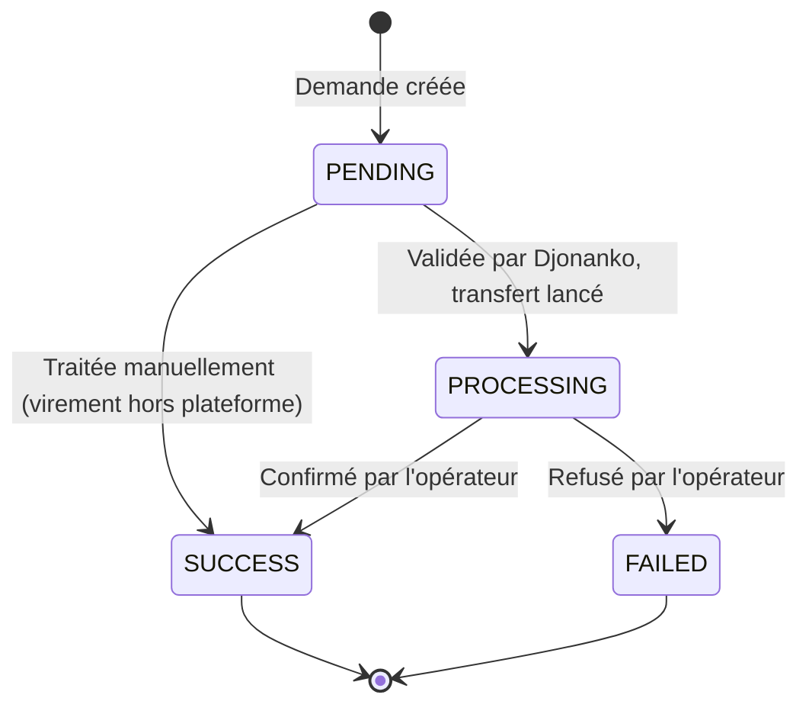

Chaque paiement `SUCCESS` crédite votre **solde** du montant net de frais. Un reversement (ou *disbursement*) transfère tout ou partie de ce solde vers un compte de votre choix.

## Le cycle d'un reversement



| Statut | Signification |
|---|---|
| `PENDING` | Demande enregistrée, en attente de validation par l'équipe Djonanko |
| `PROCESSING` | Validée : votre solde est débité et le transfert est lancé chez l'opérateur |
| `SUCCESS` | Fonds reçus sur votre compte |
| `FAILED` | Transfert échoué (voir `failureReason`) |

<Info>
Les reversements sont **validés manuellement** par Djonanko avant exécution. Le montant minimum est de **500 FCFA** et ne peut excéder votre solde disponible.
</Info>

## Frais de reversement

Des frais sont retenus sur chaque reversement, manuel ou automatique, selon le type du compte de destination :

| Compte de reversement | Frais | Exemple |
|---|---|---|
| Mobile money (Orange, MTN, Moov, Wave) | **2 %** du montant demandé | 50 000 FCFA demandés → 1 000 de frais → **49 000 reçus** |
| Virement bancaire | **1 500 FCFA** fixes | 50 000 FCFA demandés → 1 500 de frais → **48 500 reçus** |

Vocabulaire utilisé dans l'API et le dashboard :

- `amount` — le **brut** : ce que vous demandez, débité de votre solde et décompté de votre plafond mensuel ;
- `fees` — les frais retenus ;
- `netAmount` — le **net** : `amount - fees`, ce que le bénéficiaire reçoit réellement.

Avant de confirmer une demande, obtenez un devis :

```bash
curl "https://apidjonanko.tech/web-merchant/disbursement-quote?merchant_reference=beautyshop&amount=50000" \
  -H "authenticationtoken: $DJONANKO_TOKEN"
```

```json
{ "gross": 50000, "fees": 1000, "net": 49000, "method": "MOBILE_MONEY", "feeRate": 0.02, "feeFixed": null,
  "hasPrimaryAccount": true, "primaryAccountType": "wave", "minimumAmount": 500 }
```

<Note>
Le net doit rester positif et respecter le minimum du moyen de paiement : **500 FCFA** en mobile money, **20 000 FCFA** pour un virement bancaire. Une demande qui ne couvre pas les frais est refusée (`400`).
</Note>

## Règlement automatique T+0 / T+1

Par défaut, vous êtes en mode **manuel** : vous lancez chaque demande vous-même. Vous pouvez à la place activer un **règlement automatique** :

| Mode | Fonctionnement |
|---|---|
| `MANUAL` (défaut) | Vous lancez vos demandes quand vous le souhaitez, depuis le dashboard ou l'API. |
| `T0` | **Chaque jour**, à l'heure que vous choisissez, votre solde est reversé automatiquement sur votre compte principal. |
| `T1` | **Tous les deux jours**, à l'heure choisie, même traitement. |

Le réglage se fait dans le dashboard, onglet **Gestion des comptes → Règlement automatique**, ou par API :

```bash
# Activer T+0 à 18h (heure d'Abidjan)
curl -X PATCH https://apidjonanko.tech/web-merchant/settlement-settings \
  -H "Content-Type: application/json" \
  -H "authenticationtoken: $DJONANKO_TOKEN" \
  -d '{ "merchant_reference": "beautyshop", "mode": "T0", "time": "18:00" }'

# Revenir en manuel
curl -X PATCH https://apidjonanko.tech/web-merchant/settlement-settings \
  -H "Content-Type: application/json" \
  -H "authenticationtoken: $DJONANKO_TOKEN" \
  -d '{ "merchant_reference": "beautyshop", "mode": "MANUAL" }'
```

Ce qu'il faut savoir :

- **Un compte principal est requis** pour activer `T0` / `T1` ; l'heure est interprétée dans le fuseau `Africa/Abidjan` (UTC+0).
- Le montant reversé est **tout votre solde disponible**, dans la limite du restant mensuel. Les frais s'appliquent comme pour une demande manuelle.
- Si le solde est inférieur au minimum (500 FCFA, ou 20 000 FCFA net pour une banque), le règlement est **reporté** au passage suivant et le montant s'accumule.
- **En mode automatique, les demandes manuelles sont désactivées** : `POST /request-disbursement` renvoie `400`. Repassez en `MANUAL` pour en lancer une.
- Les reversements automatiques apparaissent dans la liste avec `automatic: true` et `settlementMode: "T0" | "T1"`, et suivent le même cycle de statuts. Ils sont validés et transférés immédiatement ; si le transfert automatique est impossible (virement bancaire non automatisable, RIB incomplet…), la demande reste `PENDING` pour un traitement manuel par Djonanko.
- Consultez l'état courant avec [`GET /web-merchant/settlement-settings`](/api-reference/reversements/settlement-settings-get) (`mode`, `time`, `lastSettlementAt`).

## 1. Enregistrer un compte de reversement

Avant toute demande, déclarez au moins un compte et définissez-le comme **principal**. Cela se fait dans le dashboard (**Gestion des comptes**) ou par API.

<Tabs>
  <Tab title="Mobile money">
    ```bash
    curl -X POST https://apidjonanko.tech/web-merchant/payout-accounts \
      -H "Content-Type: application/json" \
      -H "authenticationtoken: $DJONANKO_TOKEN" \
      -d '{
        "merchant_reference": "beautyshop",
        "type": "wave",
        "isPrimary": true,
        "phoneNumber": "+2250700000000",
        "country": "CI"
      }'
    ```
    `type` accepte `orange`, `moov`, `mtn` ou `wave`.
  </Tab>
  <Tab title="Compte bancaire">
    Récupérez d'abord l'identifiant de la banque :

    ```bash
    curl https://apidjonanko.tech/banks/active
    ```

    Puis créez le compte :

    ```bash
    curl -X POST https://apidjonanko.tech/web-merchant/payout-accounts \
      -H "Content-Type: application/json" \
      -H "authenticationtoken: $DJONANKO_TOKEN" \
      -d '{
        "merchant_reference": "beautyshop",
        "type": "bank",
        "isPrimary": true,
        "beneficiaryName": "SARL Beauty Shop",
        "bankId": "<id_banque>",
        "branchCode": "01001",
        "accountNumber": "012345678901",
        "ribKey": "45",
        "swiftCode": "SGBCCIABXXX"
      }'
    ```

    Le code SWIFT doit comporter 8 ou 11 caractères alphanumériques majuscules.
  </Tab>
</Tabs>

Pour changer de compte principal : [`PATCH /payout-accounts/{id}/set-primary`](/api-reference/reversements/set-primary-payout-account).

## 2. Demander un reversement (mode manuel)

```bash
curl -X POST https://apidjonanko.tech/web-merchant/request-disbursement \
  -H "Content-Type: application/json" \
  -H "authenticationtoken: $DJONANKO_TOKEN" \
  -d '{ "reference": "beautyshop", "amount": 50000 }'
```

```json
{
  "id": "…",
  "reference": "beautyshop",
  "amount": 50000,
  "destination": "+2250700000000",
  "country": "CI",
  "operator": "wave",
  "status": "PENDING",
  "fees": 1000,
  "netAmount": 49000,
  "feeBreakdown": { "gross": 50000, "fees": 1000, "net": 49000, "method": "MOBILE_MONEY", "feeRate": 0.02, "feeFixed": null },
  "automatic": false,
  "payoutAccountId": "…",
  "payoutDetails": { "type": "wave", "phoneNumber": "+2250700000000", "country": "CI" },
  "createdAt": "2026-09-18T10:00:00.000Z"
}
```

La demande est **toujours adressée au compte principal** s'il existe. Les champs `destination`, `country` et `operator` ne sont pris en compte que si aucun compte principal n'est enregistré (compatibilité avec les anciennes intégrations).

Erreurs possibles : solde insuffisant, montant < 500 FCFA, net insuffisant pour couvrir les frais, plafond mensuel atteint, aucun compte principal, ou règlement automatique activé. Voir [Gestion des erreurs](/concepts/erreurs).

## 3. Suivre les reversements

```bash
# Tous les reversements
curl "https://apidjonanko.tech/web-merchant/list-disbursements?merchant_reference=beautyshop" \
  -H "authenticationtoken: $DJONANKO_TOKEN"

# Uniquement ceux en cours
curl "https://apidjonanko.tech/web-merchant/list-disbursements?merchant_reference=beautyshop&status=PROCESSING" \
  -H "authenticationtoken: $DJONANKO_TOKEN"

# Compteurs par statut
curl "https://apidjonanko.tech/web-merchant/refunds-stats?merchant_reference=beautyshop" \
  -H "authenticationtoken: $DJONANKO_TOKEN"
```

<Note>
Il n'y a pas de webhook pour les reversements. Interrogez `list-disbursements` périodiquement, ou consultez l'onglet **Remboursements** du dashboard.
</Note>

## Consulter le solde

```bash
curl "https://apidjonanko.tech/web-merchant/get-balance?merchant_reference=beautyshop" \
  -H "authenticationtoken: $DJONANKO_TOKEN"
```

La réponse est une **chaîne décimale** (`"125000.00"`) : convertissez-la en nombre avant tout calcul.
