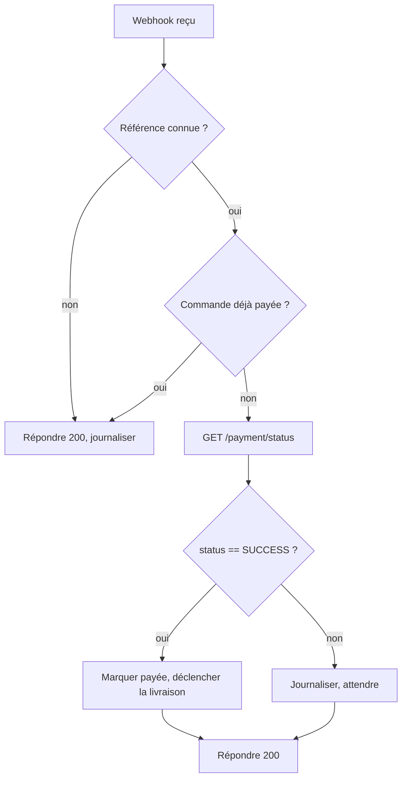

Le webhook est le canal principal de notification, mais vous devez pouvoir **vérifier un paiement à la demande** : pour confirmer un webhook, rattraper une notification perdue, ou afficher l'état d'une commande.

## Statut d'un paiement

[`GET /web-merchant/payment/status`](/api-reference/paiements/payment-status) renvoie le statut courant à partir de la référence `PAY…`.

```bash
curl "https://apidjonanko.tech/web-merchant/payment/status?payment_reference=PAYR9PVUYEWVF" \
  -H "authenticationtoken: $DJONANKO_TOKEN"
```

```json
{
  "id": "50f668cf-2a84-41e7-9bcb-6874b0d5d286",
  "reference": "PAYR9PVUYEWVF",
  "order_id": "CMD-2026-00042",
  "status": "SUCCESS",
  "createdAt": "2026-09-18T08:00:00.000Z"
}
```

<Note>
Cet endpoint utilise le **jeton marchand** (`authenticationtoken`), pas la clé API. Voir [Authentification](/concepts/authentification#jeton-marchand-operations-du-dashboard) pour obtenir un jeton depuis votre backend.
</Note>

## Obtenir et conserver un jeton côté serveur

```javascript
let cachedToken = null;

async function getMerchantToken() {
  if (cachedToken) return cachedToken;
  const res = await fetch("https://apidjonanko.tech/user/login-merchant", {
    method: "POST",
    headers: { "Content-Type": "application/json" },
    body: JSON.stringify({
      numero: process.env.DJONANKO_LOGIN,
      password: process.env.DJONANKO_PASSWORD,
    }),
  });
  if (!res.ok) throw new Error("Connexion Djonanko impossible");
  cachedToken = (await res.json()).access_token;
  return cachedToken;
}

async function getPaymentStatus(reference) {
  const call = async () =>
    fetch(
      `https://apidjonanko.tech/web-merchant/payment/status?payment_reference=${reference}`,
      { headers: { authenticationtoken: await getMerchantToken() } }
    );

  let res = await call();
  if (res.status === 401) {
    cachedToken = null; // jeton expiré : on se reconnecte une fois
    res = await call();
  }
  if (!res.ok) throw new Error(`Statut indisponible (${res.status})`);
  return res.json();
}
```

## Lister et rechercher les paiements

Pour un rapprochement en masse (fin de journée, réconciliation comptable), utilisez la recherche filtrée :

```bash
curl "https://apidjonanko.tech/web-merchant/payments/search?merchant_reference=beautyshop&status=SUCCESS&date_min=2026-09-01&date_max=2026-09-30" \
  -H "authenticationtoken: $DJONANKO_TOKEN"
```

Filtres disponibles : `date_min`, `date_max`, `reference` (recherche partielle sur `PAY…` ou `order_id`), `status`, `operator`, `country`. Détails sur [`GET /web-merchant/payments/search`](/api-reference/paiements/search-payments).

Pour un export fichier (Excel, PDF, CSV) avec les mêmes filtres : [`GET /web-merchant/payments/export`](/api-reference/paiements/export-payments).

## Stratégie recommandée



1. **Le webhook déclenche**, la vérification **confirme** : ne marquez jamais une commande payée sur la seule foi d'un webhook non vérifié.
2. **Rattrapage** : un job périodique (toutes les 15 minutes) qui liste vos commandes `PENDING` de plus de 5 minutes et interroge leur statut couvre les cas de webhook perdu.
3. **Expiration** : après 24 heures, un paiement non effectué est `FAILED`. Fermez la commande ou proposez un nouveau lien.
